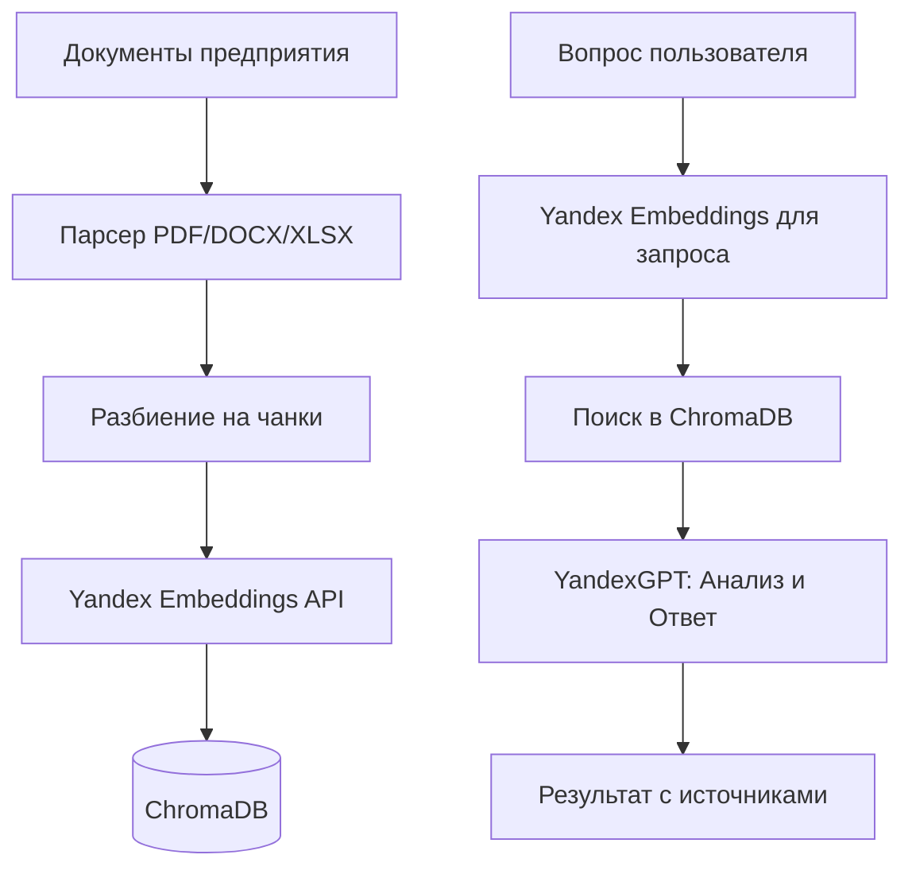

# 📄 Energoservice-r — Семантический поиск по технической документации

**AI-инструмент для семантического поиска и анализа технической документации на базе Yandex AI Studio**

Система индексирует документы предприятия и позволяет сотрудникам задавать вопросы на естественном языке. Ответы формируются строго на основе найденных фрагментов с обязательным указанием источников.

---

## 🚀 Ключевые возможности

| Возможность | Описание |
| :--- | :--- |
| **🔍 Семантический поиск** | Поиск по смыслу, а не по ключевым словам. Понимает синонимы и технические формулировки. |
| **📄 Поддержка форматов** | PDF, DOCX, XLSX. DWG конвертируется в PDF автоматически. |
| **🤖 Строгие ответы LLM** | YandexGPT отвечает только на основе найденных фрагментов. При отсутствии данных сообщает об этом. |
| **📎 Источники** | К каждому ответу прикрепляется список файлов-источников. |
| **🔄 Фоновая индексация** | Автоматическое обновление индекса каждые 30 минут (настраивается). Учитывает только изменённые файлы. |
| **🐳 Docker-развёртывание** | Готовый docker-compose с healthcheck и ротацией логов. |

---

## 🔄 Схема работы



---

## 🛠 Технологический стек

| Уровень | Технология |
| :--- | :--- |
| **Backend** | Python 3.11, FastAPI, APScheduler |
| **Векторное хранилище** | ChromaDB (PersistentClient) |
| **AI/ML** | Yandex AI Studio (Embeddings + YandexGPT) |
| **Frontend** | Node.js 20, React 18, Vite |
| **Инфраструктура** | Docker Compose, Nginx |

---

## 📁 Структура проекта

```text
Energoservice-r/
├── backend/
│   ├── app.py                  # FastAPI приложение + Yandex AI Provider
│   ├── requirements.txt        # Python зависимости
│   └── Dockerfile
├── frontend/
│   ├── src/
│   │   ├── components/         # React компоненты
│   │   │   ├── Header.jsx          # Шапка приложения
│   │   │   ├── SearchCard.jsx      # Форма поиска с кнопками
│   │   │   ├── ErrorMessage.jsx    # Блок отображения ошибок
│   │   │   └── ResultCard.jsx      # Блок ответа с источниками
│   │   ├── App.jsx             # Главный компонент (логика и состояние)
│   │   ├── App.css             # Глобальные стили приложения
│   │   └── main.jsx            # Точка входа React
│   ├── nginx.conf              # Конфигурация Nginx (прокси + таймауты)
│   ├── vite.config.js          # Конфигурация Vite
│   ├── package.json            # Зависимости frontend
│   └── Dockerfile
├── docs/                       # Папка с документами (монтируется в контейнер)
├── dwg_cache/                  # Кэш PDF из DWG-чертежей
├── chroma_db/                  # Локальная векторная база ChromaDB
├── logs/                       # Логи приложения (ротация 10MB × 5)
├── .env                        # Секреты и настройки (не коммитится)
├── docker-compose.yml          # Оркестрация контейнеров
├── pyproject.toml              # Конфигурация Python проекта
└── uv.lock                     # Lock-файл зависимостей uv
```

---

## ⚙️ Настройка окружения

Создайте файл `.env` в корне проекта:

```env
# Yandex AI Studio
YANDEX_API_KEY=your_api_key_here
YANDEX_FOLDER_ID=your_folder_id_here

# Настройки индексации
DOC_DIR=./docs
DWG_CACHE_DIR=./dwg_cache
CHUNK_SIZE=500
CHUNK_OVERLAP=50
TOP_K=6
INDEX_INTERVAL_MINUTES=30

# SSL (для корпоративных прокси)
SSL_VERIFY=false
```

### Получение ключей Yandex AI Studio

1. **YANDEX_API_KEY** — создайте API-ключ в [Yandex AI Studio](https://aistudio.yandex.ru/)
2. **YANDEX_FOLDER_ID** — идентификатор каталога Yandex Cloud (берётся из настроек проекта)

---

## ▶️ Запуск проекта

### 1. Клонирование и подготовка
```bash
git clone <your-repo-url>
cd Energoservice-r
mkdir -p docs dwg_cache
```

### 2. Настройка
```bash
# Создайте .env файл (см. раздел выше)
nano .env
```

### 3. Запуск
```bash
docker compose up -d --build
```

### 4. Проверка
*   🌐 **Веб-интерфейс:** `http://localhost`
*   📊 **Dashboard с метриками:** `http://localhost:8000/dashboard`
*   🩺 **Статус системы (красивая страница):** `http://localhost:8000/api/health`
*   📄 **Статус системы (JSON):** `curl http://localhost:8000/api/health`
*   📖 **Swagger API:** `http://localhost:8000/docs`

### 5. Управление
```bash
docker compose logs -f backend     # Логи бэкенда
docker compose restart backend     # Перезапуск после смены .env
docker compose down                # Остановка
```

---

## 🔌 API Endpoints

| Метод | Путь | Описание | Тело запроса | Ответ |
| :--- | :--- | :--- | :--- | :--- |
| **GET** | `/api/health` | Статус системы, аптайм | – | `{"status":"healthy", ...}` |
| **GET** | `/api/ready` | Кол-во проиндексированных документов | – | `{"status":"ok", "indexed_count": N}` |
| **POST** | `/api/index` | Ручной запуск индексации | – | `{"status":"success", ...}` |
| **POST** | `/api/query` | Поиск и генерация ответа | `{"question": "..."}` | `{"answer": "...", "sources": [...]}` |

> ⚠️ При ошибках возвращаются стандартные HTTP-коды 4xx/5xx с описанием в поле `detail`.

---

## 📝 Как работают эмбеддинги

Согласно документации Yandex AI Studio используются две модели:

| Модель | URI | Применение |
| :--- | :--- | :--- |
| **text-search-doc** | `emb://{folder_id}/text-search-doc/latest` | Индексация документов (длинные тексты) |
| **text-search-query** | `emb://{folder_id}/text-search-query/latest` | Векторизация запросов (короткие тексты) |

Это обеспечивает более точный поиск за счёт специализации моделей.

---

## ⚠️ Ограничения и особенности

* **OCR не включён** — растровые сканы и фотографии страниц не индексируются. Требуется текст, выделяемый курсором.
* **DWG → только текст** — геометрия не анализируется. Индексируются штампы, спецификации и текстовые слои.
* **Конвертер DWG** — требуется ODAFileConverter. При отсутствии DWG пропускаются.
* **Не является СЭД** — система не хранит версии файлов и не управляет их жизненным циклом.

---

## 🛠 Устранение проблем

| Симптом | Решение |
| :--- | :--- |
| **400 Invalid model schema** | Проверьте `YANDEX_FOLDER_ID` в .env |
| **401 Unauthorized** | Убедитесь, что `YANDEX_API_KEY` корректен и активен |
| **500 embedding failed** | Проверьте доступность Yandex API и квоты |
| **Файлы не индексируются** | Проверьте права на `./docs` и расширения файлов |
| **Container unhealthy** | `docker compose logs backend` |

---

## 📞 Поддержка и развитие

Проект готов к промышленной эксплуатации. Возможные расширения:
* 🔐 Авторизация (LDAP/SSO/JWT)
* 👥 Ролевая модель доступа
* 🖼️ OCR для сканов (Tesseract)
* 📊 Метрики Prometheus + Grafana

**Лицензия:** Внутреннее использование
**Дата версии:** 08.04.2026
